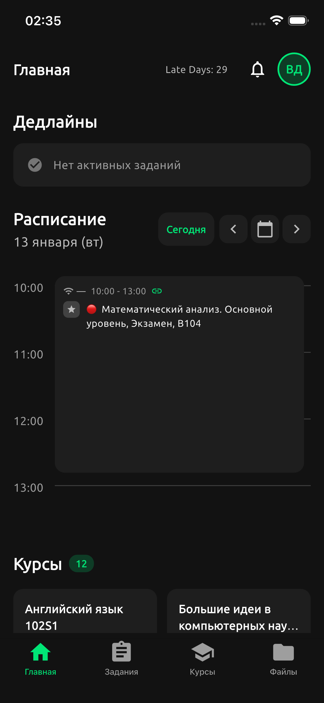
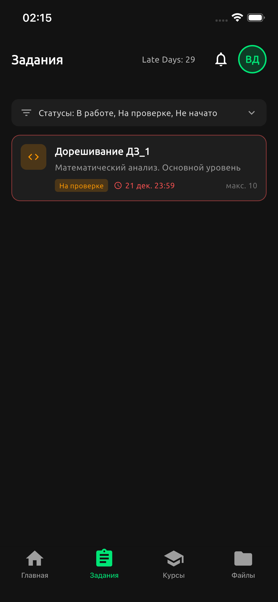
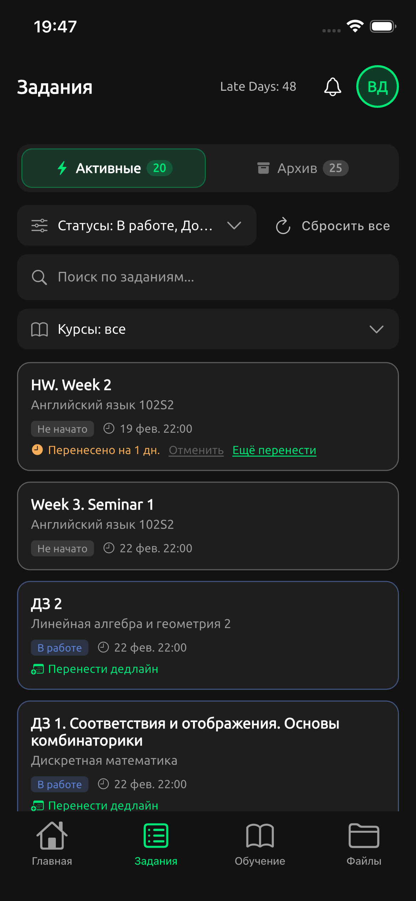
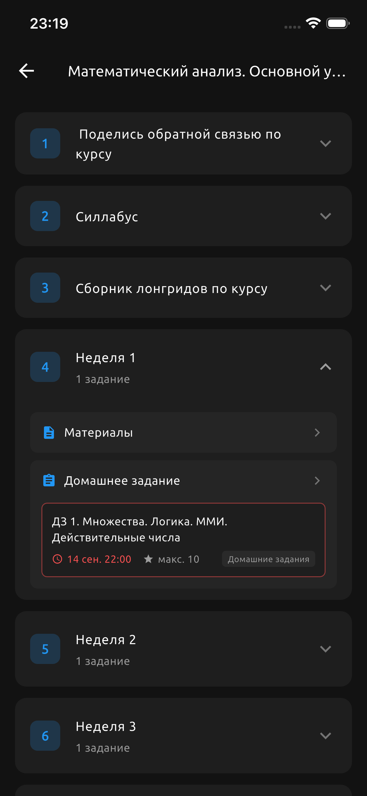
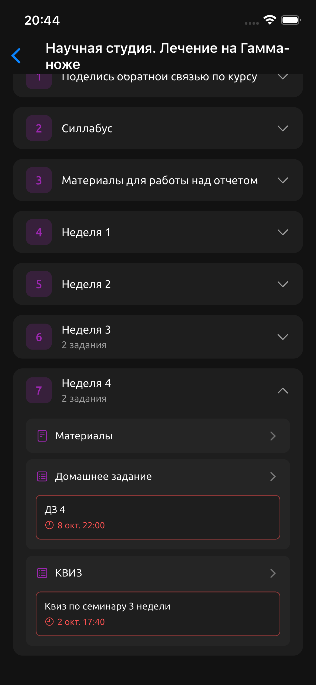
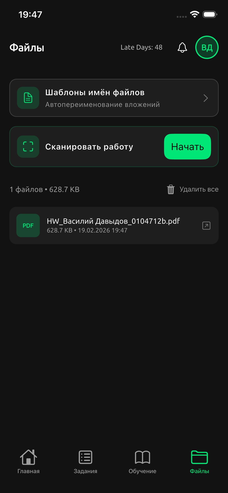

# lms-mobile


Приложение на Flutter для LMS Центрального университета.

## Возможности

- Авторизация и профиль пользователя
- Курсы и темы с деталями
- Задания, фильтры и прогресс
- Просмотр материалов и вложений
- Календарь (CalDAV) и расписание
- Уведомления

## Скриншоты








## Требования

- Flutter SDK 3.38.5 (stable)
- Dart SDK 3.10.4
- Xcode (для iOS) / Android Studio (для Android)

## Быстрый старт

1. Установить зависимости:
   ```bash
   flutter pub get
   ```
2. Запуск:
   ```bash
   flutter run
   ```

## Сборка

- iOS:
  ```bash
  flutter build ios
  ```
- Android:
  ```bash
  flutter build apk
  ```

## Архитектура

Проект построен по feature‑first подходу с разделением на слои:

- `lib/app/` — запуск приложения, тема, локализация
- `lib/core/` — общие сервисы и утилиты
- `lib/data/models/` — модели данных
- `lib/data/services/` — API, CalDAV и интеграции
- `lib/features/*/pages/` — экраны по фичам
- `assets/` — статические ресурсы
