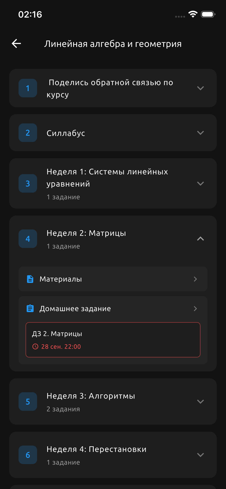
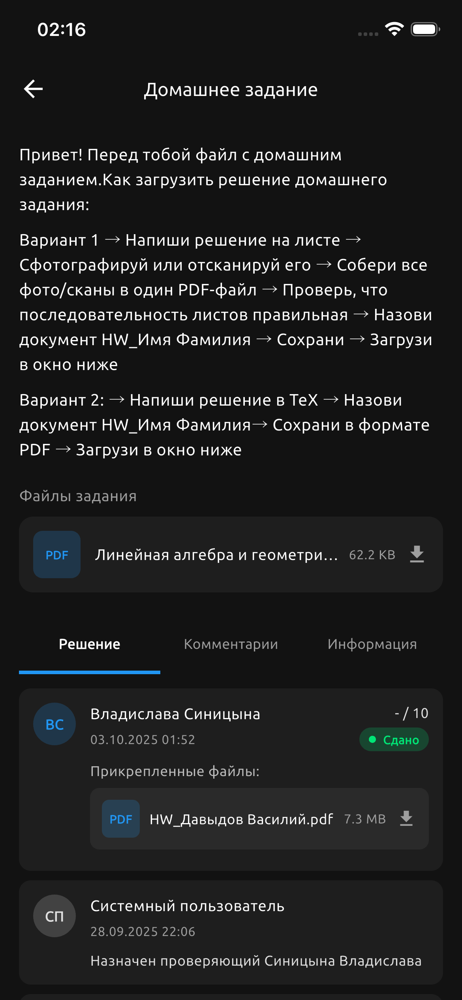

# lms-mobile


Приложение на Flutter для LMS Центрального университета.

## Возможности

- Авторизация и профиль пользователя
- Курсы и темы с деталями
- Задания, фильтры и прогресс
- Просмотр материалов и вложений
- Календарь (CalDAV) и расписание
- Уведомления

## Скриншоты





## Требования

- Flutter SDK 3.38.5 (stable)
- Dart SDK 3.10.4
- Xcode (для iOS) / Android Studio (для Android)

## Быстрый старт

1. Установить зависимости:
   ```bash
   flutter pub get
   ```
2. Запуск:
   ```bash
   flutter run
   ```

## Сборка

- iOS:
  ```bash
  flutter build ios
  ```
- Android:
  ```bash
  flutter build apk
  ```

## Архитектура

Проект построен по feature-first подходу с разделением на слои:

```
lib/
├── app/                          # Запуск приложения, тема
│   └── app.dart
├── core/                         # Общие сервисы и утилиты
│   └── services/
│       └── logging_service.dart
├── data/                         # Слой данных
│   ├── models/                   # Модели данных
│   │   ├── class_data.dart
│   │   ├── course.dart
│   │   ├── course_overview.dart
│   │   ├── longread_material.dart
│   │   ├── notification_item.dart
│   │   ├── student_lms_profile.dart
│   │   ├── student_profile.dart
│   │   ├── student_task.dart
│   │   ├── task_comment.dart
│   │   └── task_event.dart
│   └── services/                 # Сервисы API и интеграций
│       ├── api_service.dart
│       └── caldav_service.dart
├── features/                     # Фичи приложения
│   ├── auth/                     # Авторизация
│   │   └── pages/
│   │       ├── auth_wrapper.dart
│   │       └── login_page.dart
│   ├── course/                   # Курс
│   │   └── pages/
│   │       └── course_page.dart
│   ├── home/                     # Главный экран
│   │   ├── pages/
│   │   │   └── home_page.dart
│   │   └── widgets/
│   │       ├── sections/
│   │       │   ├── deadlines_section.dart
│   │       │   └── schedule_section.dart
│   │       └── tabs/
│   │           ├── courses_tab.dart
│   │           ├── files_tab.dart
│   │           └── tasks_tab.dart
│   ├── longread/                 # Материалы и задания
│   │   ├── pages/
│   │   │   └── longread_page.dart
│   │   └── widgets/
│   │       └── attachment_card.dart
│   ├── notifications/            # Уведомления
│   │   └── pages/
│   │       └── notifications_page.dart
│   └── profile/                  # Профиль
│       └── pages/
│           └── profile_page.dart
└── main.dart
```

### Слои

- **app/** — точка входа, MaterialApp, глобальная тема
- **core/** — переиспользуемые сервисы (логирование)
- **data/models/** — модели данных (Course, Task, Profile и др.)
- **data/services/** — API-клиент, CalDAV-интеграция
- **features/** — экраны и виджеты, сгруппированные по фичам
- **assets/** — статические ресурсы (иконки, скриншоты)
