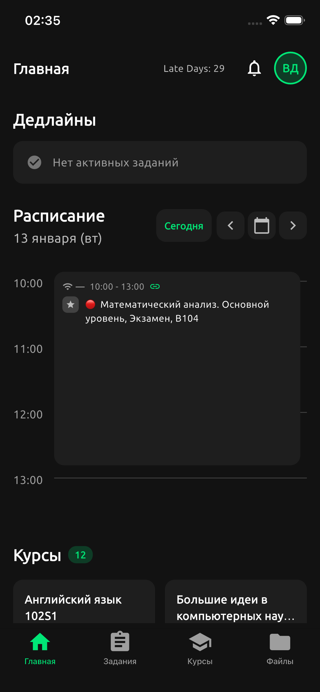
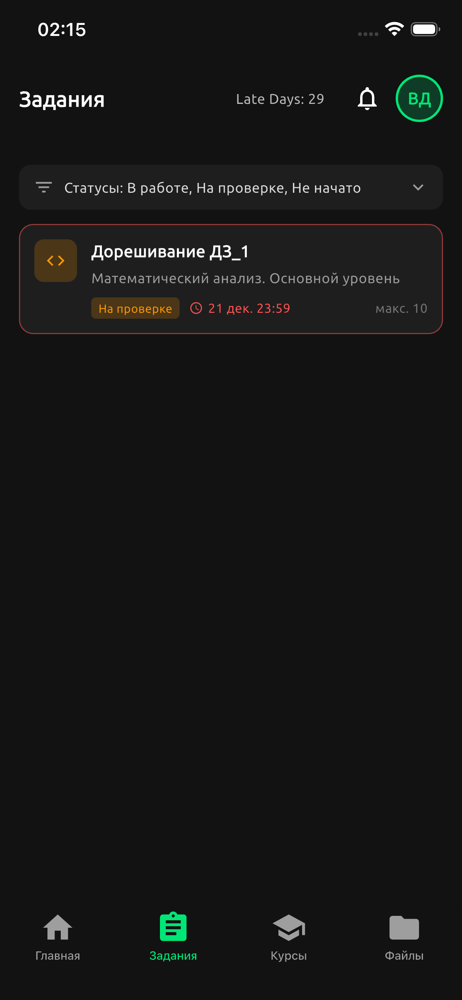
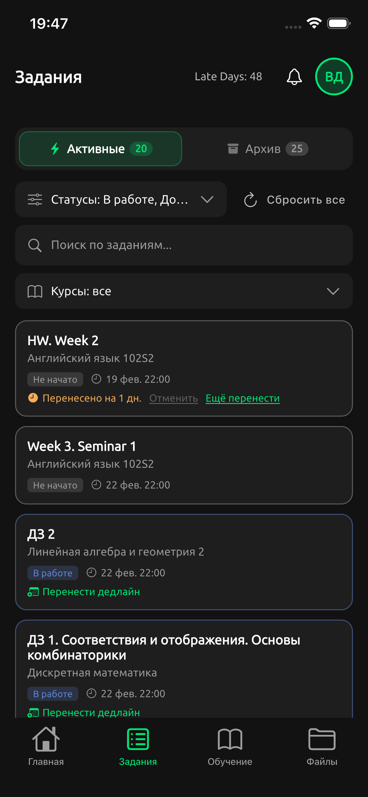
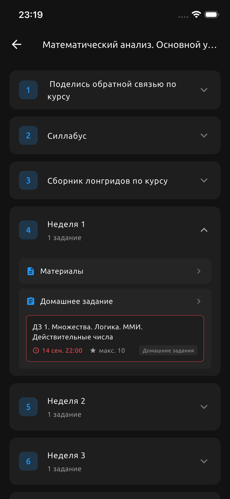
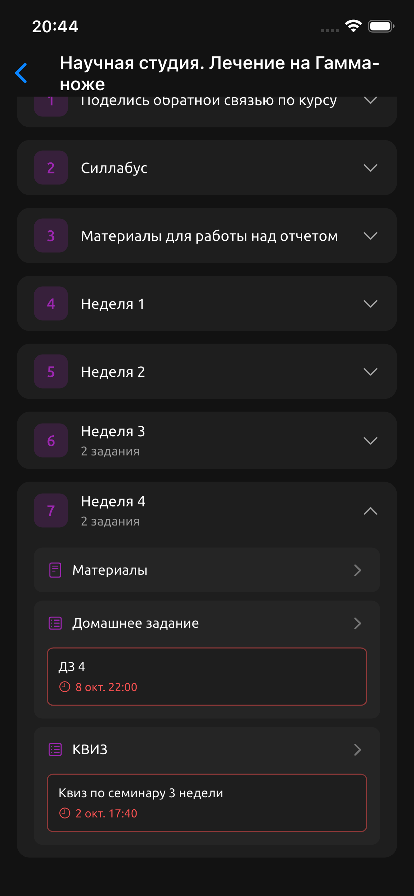
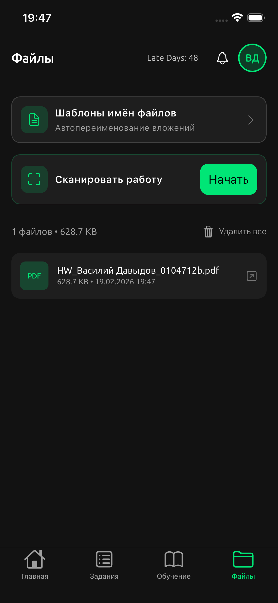

<div align="center">

# CU Mobile

**Мобильное приложение для LMS Центрального университета**

[](https://flutter.dev)
[](https://dart.dev)
[](https://www.apple.com/ios)
[](https://www.android.com)
[](LICENSE)

[Возможности](#-возможности) •
[Установка](#-установка) •
[Сборка](#-сборка) •
[Архитектура](#-архитектура) •
[Лицензия](#-лицензия)

</div>

---

## Скриншоты

<p align="center">
  
  
  
</p>

<p align="center">
  
  
  
</p>

---

## ✨ Возможности

- **Авторизация** — безопасный вход через OAuth 2.0
- **Курсы** — просмотр курсов, тем и материалов
- **Задания** — отправка работ, отслеживание дедлайнов и прогресса
- **Материалы** — чтение лонгридов, скачивание вложений
- **Расписание** — интеграция с iCal-календарём
- **Успеваемость** — просмотр оценок и статистики по курсам
- **Сканирование работ** — сканирование рукописных работ с конвертацией в PDF

---

## 📋 Требования

| Компонент | Версия |
|-----------|--------|
| Flutter SDK | 3.38+ (stable) |
| Dart SDK | 3.10+ |
| Xcode | 15+ (для iOS) |
| Android Studio | Hedgehog+ (для Android) |

---

## 🚀 Установка

### 1. Клонирование репозитория

```bash
git clone https://github.com/cu-3rd-party/lms-mobile.git
cd cumobile
```

### 2. Установка зависимостей

```bash
flutter pub get
```

### 3. Запуск приложения

```bash
# Запуск в режиме отладки
flutter run

# Запуск на конкретном устройстве
flutter run -d <device_id>
```

---

## 📦 Сборка

### iOS

```bash
# Сборка для iOS
flutter build ios --release

# Сборка IPA для распространения
flutter build ipa --release --obfuscate --split-debug-info=out/ios-symbols

```

### Android

```bash
# Сборка APK
flutter build apk --release

# Сборка App Bundle для Google Play
flutter build appbundle --release
```

---

### 🔖 Релизная сборка с повышением версии

Для сборки релиза используется скрипт `scripts/build_release.sh`.

Он автоматически:
- повышает версию в `pubspec.yaml` на основе последнего git-тега `vX.Y.Z`
- создаёт коммит и git-тег
- собирает Android APK и iOS IPA в режиме release
- сохраняет артефакты в папку `release/`

#### Использование

```bash
# Повышение patch-версии (по умолчанию)
./scripts/build_release.sh

# Повышение minor-версии
./scripts/build_release.sh minor

# Повышение major-версии
./scripts/build_release.sh major

# Повышение версии с push коммита и тега
./scripts/build_release.sh patch --push
````

## 🏗 Архитектура

Проект использует **feature-first** архитектуру с чётким разделением на слои:

```
lib/
├── app/                    # Точка входа, MaterialApp, тема
├── core/                   # Общие сервисы и утилиты
│   └── services/           # Логирование, обновления, утилиты
├── data/                   # Слой данных
│   ├── models/             # Модели данных (Course, Task, Profile)
│   └── services/           # API-клиент, iCal-интеграция
├── features/               # Функциональные модули
│   ├── auth/               # Авторизация
│   ├── course/             # Просмотр курсов
│   ├── home/               # Главный экран, вкладки
│   ├── longread/           # Материалы и задания
│   ├── notifications/      # Уведомления
│   ├── performance/        # Успеваемость
│   ├── profile/            # Профиль пользователя
│   └── settings/           # Настройки
└── main.dart               # Точка входа
```

## 🤖 Разработка с AI

Код этого проекта написан с помощью [Claude Code](https://claude.ai/claude-code) и [Cursor](https://cursor.sh).

## 📄 Лицензия

Этот проект распространяется под лицензией MIT. Подробности в файле [LICENSE](LICENSE).
